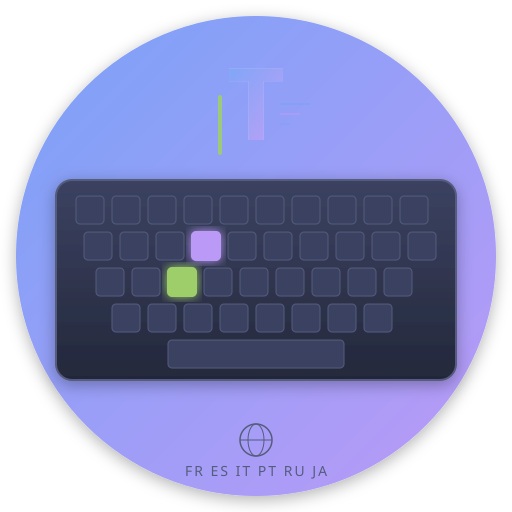

<h1 align="center">⌨️ Typing Master</h1>

<p align="center"><strong>多语言打字练习 · Multi-language Typing Practice</strong></p>

<p align="center">
  
  
  
  
  
  
</p>

<p align="center">
  
  
  
  
</p>

<p align="center">
  
</p>

---

A desktop typing practice app built with **Electron**. Master keyboard layouts and special characters for 6 languages through interactive exercises, real-time feedback, and detailed statistics.

## ✨ Features

- **6 Languages** — French, Spanish, Italian, Portuguese, Russian, Japanese
- **Virtual Keyboard** — US International (dead keys), Russian ЙЦУКЕН, Japanese JIS kana
- **3 Game Modes** — Free practice, timed challenge, precision mode
- **Difficulty Levels** — A1–C1 (CEFR) / N5–N1 (JLPT)
- **Real-time Stats** — WPM, accuracy, progress tracking with per-character error analysis
- **Built-in Manuals** — Typing guides for accented characters, Cyrillic, and kana input
- **Offline** — No internet required, all data bundled locally

## 📸 Screenshots

| Welcome | Practice | Statistics |
|---------|----------|------------|
| Language selection | Virtual keyboard + real-time feedback | Error analysis & category breakdown |

## 🚀 Quick Start

### Download

Grab the latest release from [Releases](https://github.com/CacinieP/typing-master/releases):

- **Windows**: `Typing-Master-Setup-x.x.x.exe` (NSIS installer)
- **macOS**: `Typing-Master-x.x.x.dmg` (x64 / arm64)

### Development

```bash
git clone https://github.com/CacinieP/typing-master.git
cd typing-master
npm install
npm start
```

### Build from Source

```bash
npm run build:win    # Windows NSIS installer
npm run build:mac    # macOS DMG (x64 + arm64)
```

## 🗂️ Project Structure

```
typing-master/
├── main.js              # Electron main process
├── index.html           # App entry point
├── js/
│   ├── renderer.js      # Game logic & UI
│   ├── keyboard.js      # Virtual keyboard layouts
│   └── stats.js         # Statistics & localStorage
├── words/               # Word data per language
│   ├── fr.js  es.js  it.js
│   ├── pt.js  ru.js  ja.js
├── css/style.css        # Tokyo Night theme
├── manuals/             # Language-specific typing guides
└── assets/icon.svg      # App icon
```

## 📄 License

[MIT](LICENSE) © CacinieP
